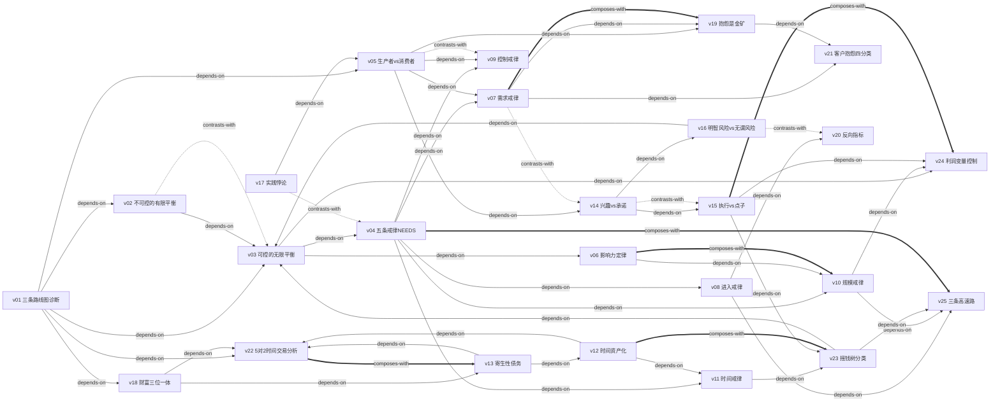

# 《百万富翁快车道》— Skill Index

> 本书由 book2skill 蒸馏，共产出 **25** 个 skills。
> 处理时间: 2026-06-07

## 关于这本书

- **作者**: MJ·德马科（MJ DeMarco）
- **出版年**: 2011（英文原版），中文译本 2017
- **一句话主旨**: 财富不是靠打工攒几十年工资、靠股市复利慢慢滚出来的，而是通过建立一个具有杠杆效应的业务系统，在短时间内满足大量市场需求，从而快速获得财务自由。
- **整书理解**: 见 [BOOK_OVERVIEW.md](./BOOK_OVERVIEW.md)

---

## Skill 列表（按主题分组）

### 诊断类

- [`v01-三条路线图诊断`](./v01-三条路线图诊断/SKILL.md) — 识别自己目前在人行道/慢车道/快车道哪条路上，以及如何切换
- [`v02-不可控的有限平衡`](./v02-不可控的有限平衡/SKILL.md) — 用数学公式解剖任何财富策略的内在缺陷，判断策略是否可行
- [`v03-可控的无限平衡`](./v03-可控的无限平衡/SKILL.md) — 快车道的数学引擎：净利润 × 资产价值的杠杆效应

### 思维转换类

- [`v05-生产者vs消费者思维转换`](./v05-生产者vs消费者思维转换/SKILL.md) — 从"买"到"卖"的认知跨越，用生产者眼光看世界
- [`v14-兴趣vs承诺-红线原则`](./v14-兴趣vs承诺-红线原则/SKILL.md) — 区分"感兴趣"和"真正承诺"的行动框架
- [`v17-实践悖论识别`](./v17-实践悖论识别/SKILL.md) — 识别"说一套做一套"的大师建议的批判框架

### 戒律类

- [`v04-五条戒律NEEDS检查`](./v04-五条戒律NEEDS检查/SKILL.md) — 评估一个生意是否值得投入的快速验证清单
- [`v07-需求戒律-解决需求而非满足自我`](./v07-需求戒律-解决需求而非满足自我/SKILL.md) — 生意的唯一目的是解决别人的问题，不是满足自己的愿望
- [`v08-进入戒律-高壁垒才是好赛道`](./v08-进入戒律-高壁垒才是好赛道/SKILL.md) — 低进入壁垒 = 拥堵的赛道 = 微薄利润
- [`v09-控制戒律-自己驾驶不搭便车`](./v09-控制戒律-自己驾驶不搭便车/SKILL.md) — 你的生意必须由你掌握核心控制权
- [`v10-规模戒律-规模决定财富天花板`](./v10-规模戒律-规模决定财富天花板/SKILL.md) — 生意的市场水域决定了你的财富上限
- [`v11-时间戒律-让业务与时间脱钩`](./v11-时间戒律-让业务与时间脱钩/SKILL.md) — 让业务系统替你工作，而不是你为时间工作

### 增长策略类

- [`v24-利润变量控制`](./v24-利润变量控制/SKILL.md) — 操纵转化率、流量、利润率三个杠杆驱动增长
- [`v15-执行vs点子乘法效应`](./v15-执行vs点子乘法效应/SKILL.md) — 点子本身不值钱，值钱的是在多大范围内被执行
- [`v25-三条高速快车道选择`](./v25-三条高速快车道选择/SKILL.md) — 互联网、创新、分发三条路径的选择框架

### 资产管理类

- [`v06-影响力定律`](./v06-影响力定律/SKILL.md) — 影响百万人才能赚百万美元：财富的数学底层原理
- [`v12-时间资产化`](./v12-时间资产化/SKILL.md) — 把时间从负债变成资产：投入一次时间构建系统，持续产生回报
- [`v13-寄生性债务识别与清除`](./v13-寄生性债务识别与清除/SKILL.md) — 识别并清除吞噬你自由时间的"坏债务"
- [`v22-5对2时间交易分析`](./v22-5对2时间交易分析/SKILL.md) — 用投资回报率逻辑分析工作与自由的时间交易
- [`v23-摇钱树五种苗分类`](./v23-摇钱树五种苗分类/SKILL.md) — 五种快车道业务模式的被动性评级与选择

### 决策辅助类

- [`v16-明智风险vs无谓风险`](./v16-明智风险vs无谓风险/SKILL.md) — 用下行空间和上行空间的对称性区分风险类型
- [`v19-抱怨是金矿-需求发现`](./v19-抱怨是金矿-需求发现/SKILL.md) — 从日常抱怨中发现未被满足的市场需求
- [`v20-大家都在做反向指标`](./v20-大家都在做反向指标/SKILL.md) — 利用从众行为作为反向信号的推理方法
- [`v21-客户抱怨四分类处理`](./v21-客户抱怨四分类处理/SKILL.md) — 将客户投诉分为变化/期望/无效/欺诈四类分别处理

### 价值观类

- [`v18-财富三位一体模型`](./v18-财富三位一体模型/SKILL.md) — 真正财富由家庭(Family)、健康(Fitness)、自由(Freedom)三者构成

---

## 引用图



**图例**:
- `-->` depends-on（依赖/前置）
- `-.->` contrasts-with（对立/替代视角）
- `===>` composes-with（组合/配合使用）

---

## 推荐学习顺序

（从依赖图的叶子节点开始，向上）

### 第一阶段：认知基础（无前置依赖）

1. **v01 三条路线图诊断** — 最基础，没有前置。先判断自己当前在哪条路上
2. **v17 实践悖论识别** — 批判性思维，帮你过滤错误建议，保护后续学习不被误导

### 第二阶段：数学原理与思维转换

3. **v02 不可控的有限平衡** — 依赖 v01。理解慢车道在数学上就输了
4. **v03 可控的无限平衡** — 依赖 v01+v02。理解快车道的数学引擎
5. **v05 生产者vs消费者思维转换** — 依赖 v01。从"买"到"卖"的认知跨越
6. **v14 兴趣vs承诺-红线原则** — 依赖 v05。从"想想"到"真干"的行动框架
7. **v15 执行vs点子乘法效应** — 依赖 v14。破除"等待完美点子"的障碍

### 第三阶段：生意评估框架

8. **v04 五条戒律NEEDS检查** — 依赖 v03。核心生意验证框架
9. **v07 需求戒律** — 依赖 v04。先验证需求（最重要的戒律）
10. **v08 进入戒律** — 依赖 v04。检查赛道是否拥堵
11. **v09 控制戒律** — 依赖 v04。检查控制权是否在自己手中
12. **v10 规模戒律** — 依赖 v04+v06。检查增长天花板
13. **v11 时间戒律** — 依赖 v04+v23。检查是否能从生意中解放

### 第四阶段：时间与资产管理

14. **v22 5对2时间交易分析** — 依赖 v01。量化你当前的时间交易回报率
15. **v12 时间资产化** — 依赖 v22。把时间从负债变成资产
16. **v13 寄生性债务识别与清除** — 依赖 v22+v12。清除吞噬自由时间的债务
17. **v06 影响力定律** — 依赖 v03。理解财富的底层数学原理
18. **v18 财富三位一体模型** — 依赖 v01+v22。在追求财富时保持家庭、健康、自由的平衡

### 第五阶段：增长与决策

19. **v16 明智风险vs无谓风险** — 依赖 v01+v03。学会区分该冒和不该冒的风险
20. **v20 大家都在做反向指标** — 依赖 v08。避免从众陷阱
21. **v19 抱怨是金矿-需求发现** — 依赖 v05+v07。从抱怨中发现商机
22. **v21 客户抱怨四分类处理** — 依赖 v07+v19。已有客户后的投诉处理框架
23. **v23 摇钱树五种苗分类** — 依赖 v03+v11。选择适合的商业模式结构
24. **v24 利润变量控制** — 依赖 v03+v10。操纵杠杆驱动业务增长
25. **v25 三条高速快车道选择** — 依赖 v04+v23。综合评估后选择创业路径

---

## 接入 darwin-skill

所有 skill 均带有 `test-prompts.json`（darwin-skill 兼容格式），可直接接入自动进化：

```
darwin evolve books/百万富翁快车道/
```

---

## 审计轨迹

- 候选单元池: [candidates/](./candidates/)
- 被淘汰的候选（含原因）: [rejected/](./rejected/)
- BOOK_OVERVIEW: [BOOK_OVERVIEW.md](./BOOK_OVERVIEW.md)
