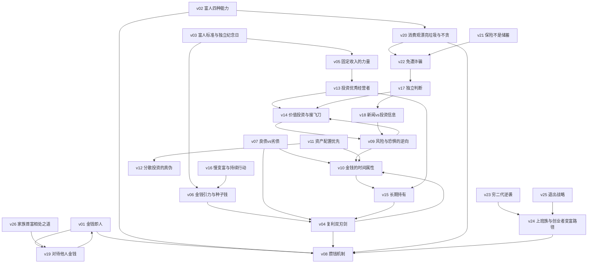

# 《金钱的属性：一个富豪的财富私房课》— Skill Index

> 本书由 cangjie-skill（RIA-TV++ 管道）蒸馏，共产出 **26** 个 skills。
> 处理时间: 2026-06-xx

## 关于这本书

- **作者**: 金胜镐（Kim Seung-ho，韩裔企业家，白手起家）
- **一句话主旨**: 金钱不是抽象数字，而是像人一样有品性、有引力、有时间；成为富人的关键是立对金钱观（金钱即人）+ 练就四种能力（挣钱/攒钱/保值/消费），用"慢变富"（复利+固定收入+种子钱）积累资产，直到资本收入超过劳动收入。
- **整书理解**: 见 [BOOK_OVERVIEW.md](./BOOK_OVERVIEW.md)
- **术语词典**: 见 [GLOSSARY.md](./GLOSSARY.md)

---

## Skill 列表（按主题分组）

### 金钱观与心法
- [`v01-金钱即人`](./v01-金钱即人/SKILL.md) — 待钱如友、尊重小钱的心智模型
- [`v19-对待他人金钱`](./v19-对待他人金钱/SKILL.md) — 公款/税金/朋友的钱 = 自己的钱
- [`v20-消费观漂亮垃圾与不贪`](./v20-消费观漂亮垃圾与不贪/SKILL.md) — 从炫耀消费转向需要消费、远离暴利
- [`v16-慢变富与持续行动`](./v16-慢变富与持续行动/SKILL.md) — 绝不急功近利 + 坚持100天

### 能力与标准
- [`v02-富人四种能力`](./v02-富人四种能力/SKILL.md) — 挣钱/攒钱/保值/消费四能力诊断
- [`v03-富人标准与独立纪念日`](./v03-富人标准与独立纪念日/SKILL.md) — 资本收入>劳动收入那天
- [`v05-固定收入的力量`](./v05-固定收入的力量/SKILL.md) — 现金流节奏 > 金额

### 资产积累
- [`v04-复利双刃剑`](./v04-复利双刃剑/SKILL.md) — 让复利做盟友而非敌人
- [`v06-金钱引力与种子钱`](./v06-金钱引力与种子钱/SKILL.md) — 财富倍数增长、先攒第一桶金
- [`v08-攒钱机制`](./v08-攒钱机制/SKILL.md) — 剪信用卡 + 分账存折

### 债务与风险
- [`v07-良债vs劣债`](./v07-良债vs劣债/SKILL.md) — 三条件区分债务性质
- [`v09-风险与恐惧的逆向`](./v09-风险与恐惧的逆向/SKILL.md) — 风险最大时风险最小
- [`v10-金钱的时间属性`](./v10-金钱的时间属性/SKILL.md) — 只用5年闲钱投资

### 投资方法
- [`v11-资产配置优先`](./v11-资产配置优先/SKILL.md) — 教练 > 选手
- [`v12-分散投资的真伪`](./v12-分散投资的真伪/SKILL.md) — 篮子 vs 架子
- [`v13-投资优秀经营者`](./v13-投资优秀经营者/SKILL.md) — 股东即老板、买行业第一
- [`v14-价值投资与接飞刀`](./v14-价值投资与接飞刀/SKILL.md) — 读财报 + 分批买入
- [`v15-长期持有`](./v15-长期持有/SKILL.md) — 股票5年/房地产10年

### 信息与判断
- [`v17-独立判断`](./v17-独立判断/SKILL.md) — 不信专家预测、怀疑权威
- [`v18-新闻vs投资信息`](./v18-新闻vs投资信息/SKILL.md) — 看比率不看总数

### 防坑与保障
- [`v21-保险不是储蓄`](./v21-保险不是储蓄/SKILL.md) — 佣金结构拆解
- [`v22-免遭诈骗`](./v22-免遭诈骗/SKILL.md) — 不贪 + 不碰不熟领域

### 职业与创业
- [`v23-穷二代逆袭`](./v23-穷二代逆袭/SKILL.md) — 弱者策略：差异+速度
- [`v24-上班族与创业者变富路径`](./v24-上班族与创业者变富路径/SKILL.md) — 当高管/创业/去小公司
- [`v25-退出战略`](./v25-退出战略/SKILL.md) — 出售/IPO/代代相传

### 家庭与人际
- [`v26-家族首富相处之道`](./v26-家族首富相处之道/SKILL.md) — 按资产规模分级支援

---

## 引用图（skill 关系网络）

> 边方向 = 依赖关系（A → B 表示"使用 A 时最好先理解 B"）。本图基于各 SKILL.md frontmatter 的 related_skills，无硬凑关系。

---

## 推荐学习路径

### 路径 A：零基础建立金钱观（新手首选）
**v01 金钱即人 → v08 攒钱机制 → v04 复利双刃剑 → v06 金钱引力与种子钱 → v16 慢变富**

先立心态（钱是"人"）、再建机制（不月光）、懂复利（为什么早开始）、定种子钱（第一桶金）、稳住节奏（不焦虑）。

### 路径 B：开始投资（有闲钱后）
**v10 金钱的时间属性 → v11 资产配置优先 → v12 分散投资的真伪 → v13 投资优秀经营者 → v14 价值投资与接飞刀 → v15 长期持有 → v09 风险与恐惧的逆向**

先用对钱（闲钱）、布好阵（配置）、别假分散、买对标的（行业第一/优秀经营者）、会估值（读财报）、拿得住、扛得稳（逆向）。

### 路径 C：守住与防坑（有资产后）
**v02 富人四种能力 → v03 富人标准与独立纪念日 → v05 固定收入的力量 → v21 保险不是储蓄 → v22 免遭诈骗 → v17 独立判断 → v18 新闻vs投资信息**

自测四能力、锚定独立日、优化收入结构、拆穿保险话术、防骗、独立判断、不被媒体情绪带偏。

### 路径 D：职场与创业（想变富/逆袭）
**v23 穷二代逆袭 → v24 上班族与创业者变富路径 → v25 退出战略 → v26 家族首富相处之道**

弱者心态与策略 → 具体变富路径（高管/创业/小公司）→ 创业如何退出 → 富了怎么处理家庭财务关系。

### 路径 E：价值观与消费（生活化）
**v19 对待他人金钱 → v20 消费观漂亮垃圾与不贪 → v07 良债vs劣债**

待钱如人、消费从需要出发、债务分良劣——覆盖日常金钱决策。

---

## 引用文档

- [BOOK_OVERVIEW.md](./BOOK_OVERVIEW.md) — 整书理解（阶段 0）
- [GLOSSARY.md](./GLOSSARY.md) — 共享术语词典（阶段 3）
- [verified.md](./verified.md) — 三重验证记录（阶段 1.5）
- [PIPELINE_STATE.md](./PIPELINE_STATE.md) — 流水线状态
- `candidates/` — 原始候选池（审计）
- `rejected/` — 淘汰单元（审计）
